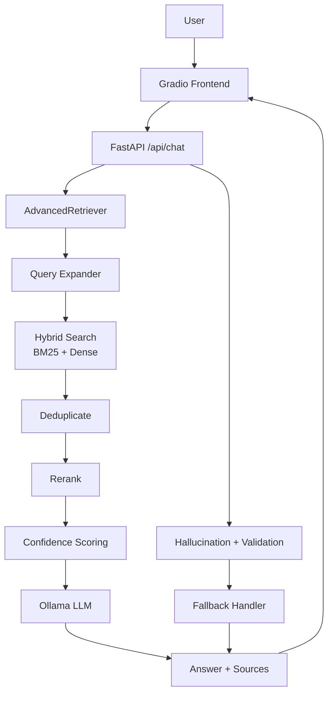
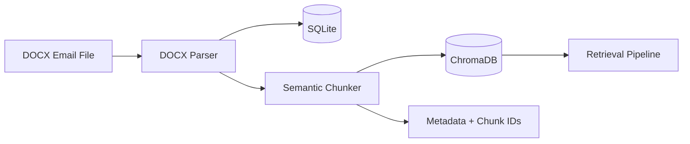
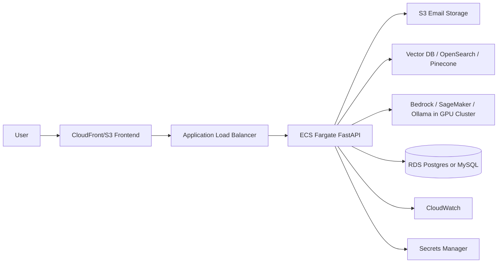

# Email RAG Chatbot - Comprehensive Project Guide

## 1. Project Overview

This repository is a production-inspired Retrieval-Augmented Generation (RAG) system built for answering questions over personal email history. The application ingests email documents, chunks them into smaller semantic units, stores them in a vector database, retrieves the most relevant evidence for a user query, and uses a local LLM to generate an answer grounded in those emails.

The system is intentionally structured in phases:

- Phase 1: Basic ingest + retrieval + local LLM answer generation
- Phase 2: Advanced retrieval pipeline with query expansion, reranking, confidence scoring, and threshold filtering
- Phase 3: Guardrails such as hallucination detection, response validation, and fallback logic

This is not just a toy demo. It follows a realistic production RAG architecture pattern:

- ingestion
- storage
- retrieval
- reranking
- validation
- answer generation
- safety/fallback workflow

---

## 2. Business Goal and Why This Exists

The goal of the project is to let a user ask questions like:

- "Which emails mentioned the project deadline?"
- "What was discussed about the release plan?"
- "Which sender mentioned the QA blocker?"

and to get an answer based only on the email corpus, not generic prior knowledge.

This matters because email data is:

- unstructured
- large in volume
- semantically complex
- often spread across many files
- full of context that an LLM alone cannot recall reliably

A RAG system addresses this by grounding the model in retrieved evidence from the email archive.

---

## 3. High-Level Architecture

### Summary

The application is made of a few key layers:

1. Frontend UI
2. FastAPI backend
3. Email ingestion and chunking
4. Retrieval and reranking engine
5. Vector store and metadata store
6. LLM generation layer
7. Validation and fallback protections
8. Evaluation and observability hooks

### Top-level component map

- Frontend: `frontend/app.py`
- Backend API: `backend/app/api/routes.py`
- App bootstrap: `backend/app/main.py`
- Config: `backend/app/config.py`
- SQLite persistence: `backend/app/storage/database.py`
- DOCX ingestion: `backend/app/ingestion/docx_parser.py`
- Chunking: `backend/app/ingestion/chunker.py`
- Retriever: `backend/app/retrieval/chroma_retriever.py`
- Advanced retriever: `backend/app/retrieval/advanced_retriever.py`
- Query expansion: `backend/app/retrieval/query_expander.py`
- Reranker: `backend/app/retrieval/reranker.py`
- Confidence scorer: `backend/app/retrieval/confidence_scorer.py`
- LLM client: `backend/app/core/llm.py`
- Hallucination detector: `backend/app/core/hallucination_detector.py`
- Response validator: `backend/app/generation/response_validator.py`
- Fallback handler: `backend/app/generation/fallback_handler.py`
- Evaluation: `backend/app/evaluation/`

---

## 4. Core Technologies Used

- FastAPI: REST API layer
- Gradio: basic local web UI
- SQLite: source-of-truth metadata store for email documents
- ChromaDB: persistent vector database for semantic retrieval
- BM25: lexical keyword retrieval
- SentenceTransformers: embeddings + cross-encoder models
- Ollama: local LLM serving layer
- SQLAlchemy: database ORM
- Pydantic: request/response validation
- Python-docx: DOCX email parsing
- LangChain text splitters: chunking logic
- CrossEncoder NLI models: contradiction/hallucination detection

---

## 5. System Flow Overview

### Request flow at a glance



### Ingestion flow at a glance



---

## 6. Ingestion Pipeline

### What happens when an email is ingested?

The ingest endpoint `POST /api/ingest` is responsible for this sequence:

1. A DOCX file is uploaded through the UI or passed by file path
2. `DOCXEmailParser.parse_from_path()` reads the document
3. Relevant metadata is extracted:
   - sender name
   - sender email
   - subject
   - body
   - timestamp
4. `DatabaseManager.add_email()` stores the email into SQLite
5. `SemanticChunker.chunk()` splits the full email into smaller text chunks
6. Each chunk gets metadata:
   - source document ID
   - sender
   - timestamp
   - thread ID
   - chunk index
   - subject
7. Chunks are embedded and stored in ChromaDB for vector search
8. BM25 index is also built for keyword/traditional retrieval

### Why this matters

The retrieval system performs best when it is given meaningful chunks rather than raw full email bodies. Full emails are often too large and noisy; chunking improves search precision and keeps context manageable for the LLM.

### Example of stored chunk metadata

Each chunk contains:

- `source_doc_id`
- `sender`
- `timestamp`
- `thread_id`
- `chunk_index`
- `total_chunks`
- `subject`

This metadata allows the system to track answer provenance and show source citations to the user.

---

## 7. Database and Storage Design

### SQLite

SQLite acts as the canonical relational store for email metadata.

Primary responsibilities:

- store ingested email content
- maintain doc-level identity
- preserve sender, subject, date, and thread information
- support listing or debugging ingested emails

### ChromaDB

ChromaDB is the vector search index.

Primary responsibilities:

- store embedded chunk documents
- support semantic similarity search
- persist embeddings across application sessions
- retrieve nearest neighbors for a user query

### Important design idea

This project separates:

- transactional source-of-truth data in SQLite
- search-time retrieval data in ChromaDB

This is a common production pattern. It helps scale search independently and makes the document store easier to audit.

---

## 8. Retrieval Layer: The Real Engine of the System

This is the heart of the application.

The code uses `AdvancedRetriever`, which orchestrates the entire pipeline:

1. query expansion
2. hybrid retrieval
3. deduplication
4. reranking
5. confidence scoring
6. threshold filtering

### 8.1 Query expansion

`QueryExpander` modifies the user query into multiple query variations to improve recall.

Example:

User query:

> "What is the status of the project update?"

Possible expansions:

- "What is the status of the project update? status implementation progress"
- "What is the status of the project update?"
- "status of the project update implementation progress"
- query text with synonyms like issue/error/problem or deploy/release/launch

This helps the system catch different phrasings that may exist in the emails.

### 8.2 Hybrid retrieval

`ChromaRetriever` combines two retrieval strategies:

- BM25 lexical retrieval
- dense vector retrieval with embeddings

This is a strong pattern because:

- BM25 is good for exact keyword matches
- dense retrieval is strong for semantic similarity

The code combines them with a weighted score:

- 40% BM25
- 60% dense similarity

This allows the system to retrieve both literal and conceptually similar results.

### 8.3 Deduplication

Multiple expanded queries can retrieve the same chunk. The system deduplicates results by `chunk_id` before reranking.

This avoids redundant context and improves efficiency.

### 8.4 Reranking

`CrossEncoderReranker` uses a `CrossEncoder` model like `cross-encoder/qnli-distilroberta-base` to score query-chunk pairs directly.

This is better than just sorting by embedding similarity because it explicitly judges how relevant each chunk is to the query.

Example:

Query: "When is the release scheduled?"

Candidate chunks:

- "We plan to release in Q2 next year."
- "The budget was approved for three new hires."

Cross-encoder reranking is more likely to put the first chunk above the second because it evaluates the exact semantic match between query and chunk text.

### 8.5 Confidence scoring

`ConfidenceScorer` combines multiple signals:

- freshness of the email
- retrieval score quality
- source overlap across search results
- consistency (still simple placeholder/neutral in this project)

The formula is a weighted combination:

- freshness: 30%
- retrieval score: 40%
- overlap: 20%
- consistency: 10%

This score is used to decide whether a chunk is strong enough to be sent to the LLM.

### 8.6 Threshold filtering

Only results above `settings.confidence_threshold` are used. In the project that threshold is usually set to `0.5`.

This reduces noisy context and prevents weak or irrelevant evidence from contaminating the answer.

---

## 9. Advanced Retrieval in Detail with an Example

Imagine the user asks:

> "Which project items are still open after the last update?"

### Step 1: Query expansion

The query may become variations like:

- "Which project items are still open after the last update?"
- "Which project items are still open after the last update? open blockers issues pending"
- "open project items after last update"

### Step 2: Hybrid retrieval

The retriever searches both:

- exact keyword matches in BM25
- semantic similarity through Chroma embeddings

Candidate chunks could include:

- "The backend API is 95% complete. Testing is pending."
- "The frontend work is still blocked by design approval."
- "Several open issues remain in QA escalation."

### Step 3: Deduplication

If the same chunk appears twice because it matched both the original and expanded query, it is kept only once.

### Step 4: Reranking

The cross-encoder gives each candidate a more relevant query-chunk score.

When the user asks about open items, the chunk with "pending", "blocked", "open issues" gets ranked above a generic status sentence.

### Step 5: Confidence scoring

This step accounts for:

- whether the email is recent
- whether the chunk is highly relevant to the query
- whether the same sender or document contains multiple related results

### Step 6: LLM context assembly

Only the top confident chunks proceed to the LLM. The system builds a prompt like:

- Email Excerpt 1: ...
- Email Excerpt 2: ...
- Email Excerpt 3: ...

Then the LLM is asked to answer using only those excerpts.

### Result

The model returns a grounded answer such as:

> "The project still has open items in QA and frontend integration. The backend is mostly complete, but testing is pending and the UI is waiting on design approval."

This answer is not pulled from training memory; it is derived from the retrieved email evidence.

---

## 10. LLM Generation Layer

The LLM client is implemented in `backend/app/core/llm.py`.

It sends a call to Ollama with:

- `model`: configured in `settings.ollama_model`
- `prompt`: the user question + context excerpts
- `system`: strict instructions for grounded generation

The system prompt instructs the model to:

- only answer based on provided email context
- not invent information
- not assume details
- answer concisely
- cite sender and approximate date when relevant

Example of the model prompt structure:

```text
Email Context:
[Email Excerpt 1]: ...
[Email Excerpt 2]: ...

User Question: Which project items are still open?

Answer (stay within the context provided):
```

### Why this design matters

The model is constrained by the retrieved context. This is the heart of RAG: the model is not expected to know everything; it is expected to answer from evidence.

---

## 11. Validation and Hallucination Controls

This project includes a robust third layer of safety: validation after generation.

### 11.1 Hallucination detector

`HallucinationDetector` uses an NLI cross-encoder:

- `cross-encoder/nli-distilroberta-base`

This is a natural language inference model that evaluates the relationship between:

- context
- generated response

It computes whether the response is:

- contradiction
- entailment
- neutral

The idea is:

- if the generated answer contradicts the retrieved email context, it is likely a hallucination
- if it is supported by the context, it is more trustworthy

The model returns scores analogous to:

- contradiction probability
- neutral probability
- entailment probability

The project converts this into a contradiction score and checks it against a threshold.

### 11.2 Response validator

`ResponseValidator` looks at generated response sentences and compares them with the retrieved source text.

It roughly approximates claim coverage by checking whether sentence words overlap with the grounded context. If a large percentage of the answer is unsupported, the system flags it.

### 11.3 Fallback logic

`FallbackHandler` decides if the system should avoid returning the answer and instead return a safe fallback message.

It checks:

- hallucination detection result
- average retrieval confidence
- validation coverage

If any of these are poor, it returns a safe instruction instead of a potentially risky answer.

Examples of fallback reasons:

- Potential hallucination detected
- Low retrieval confidence
- Insufficient claim verification

Example fallback message:

> "I couldn't find strong evidence in your emails for this question. Try rephrasing or asking about a different topic."

---

## 12. End-to-End Example Walkthrough

### Example scenario

Suppose the user uploads a batch of emails and then asks:

> "What are the open blockers in the project?"

### Step-by-step

1. UI sends a POST to `/api/chat` with the query
2. `AdvancedRetriever.retrieve(query)` is called
3. `QueryExpander` creates alternate query variants
4. `ChromaRetriever` runs both BM25 and dense retrieval
5. Duplicate results are removed
6. Cross-encoder ranks the candidate chunks by relevance
7. `ConfidenceScorer` computes relevance and freshness scores
8. The system filters out weak chunks using the confidence threshold
9. `OllamaLLMClient.generate()` receives only the best evidence
10. The model generates an answer based on those email excerpts
11. `HallucinationDetector` checks for contradictions against context
12. `ResponseValidator` checks coverage and claim support
13. `FallbackHandler` decides whether to accept or replace the answer
14. The final response is returned to the frontend with sources and confidence

### Example response payload

```json
{
  "answer": "The main blockers are QA certification delays and the pending design approval for the frontend work.",
  "sources": [
    {
      "sender": "engineering@company.com",
      "timestamp": "2026-07-12T09:30:00",
      "confidence": 0.82,
      "score": 0.89
    }
  ],
  "confidence": 0.79,
  "execution_time_ms": 482,
  "fallback_used": false,
  "hallucination_detected": false,
  "validation_coverage": 0.9
}
```

---

## 13. Evaluation Strategy and Metrics

The project includes evaluation scripts under `backend/app/evaluation/`.

### Included metrics

- MRR (Mean Reciprocal Rank)
- precision@k
- recall@k
- basic retrieval quality comparisons

### Evaluation files

- `backend/app/evaluation/eval_dataset.py`
- `backend/app/evaluation/metrics.py`
- `backend/app/evaluation/evaluation_report.py`
- `backend/app/evaluation/ragas_evaluator.py`

### Why evaluation matters

Without evaluation, retrieval quality is a black box. This project tries to compare:

- phase 1 baseline retrieval
- phase 2 advanced retriever

The goal is to answer questions like:

- Did the new retrieval approach improve ranking quality?
- Is recall better after query expansion?
- Are we sending better evidence to the LLM?

### How the project uses RAGAS and evaluation concepts

The repo contains a placeholder `RAGASEvaluator` class, showing that the system intends to eventually evaluate:

- faithfulness
- answer relevance
- context relevance

However, the current implementation remains simplified and lightweight rather than a full production RAGAS pipeline.

### Does evaluation reduce hallucination?

Evaluation helps indirectly, but the stronger direct guardrail in this project is the combination of:

- hallucination detection (NLI)
- response validation
- confidence thresholding
- fallback logic

The system does not claim to fully eliminate hallucinations, but it reduces risk by filtering weak evidence and refusing unsafe outputs.

---

## 14. Fallback Mechanisms Used in the Project

The project includes several defensive layers:

### 14.1 Confidence-based fallback

If the retriever finds no chunk above the confidence threshold, the system returns:

> "I don't have enough information in your emails to answer this question."

### 14.2 Hallucination fallback

If the answer contradicts context, it triggers a fallback instead of returning the risky answer.

### 14.3 Validation fallback

If the response fails coverage checks or is not well-supported by the context, the system refuses to answer confidently.

### 14.4 LLM-safe prompt design

The system prompt explicitly tells the model not to invent information and to answer only within the given evidence.

This is one of the most practical safeguards in a local RAG workflow.

---

## 15. NLI in This Project: What It Is and Why It Was Used

NLI stands for Natural Language Inference.

In simple terms, NLI measures the relationship between two texts:

- premise: the email context
- hypothesis: the model-generated answer

The model classifies whether the hypothesis:

- contradicts the premise
- is entailed by the premise
- is neutral with respect to the premise

### Why it was used here

This project is trying to answer questions using email evidence. That makes contradiction detection extremely important.

Without NLI:

- the model may answer confidently but be unsupported
- the app may return claims not present in emails
- hallucinated responses look polished and authoritative

With NLI:

- the system can catch contradictions
- low-confidence or unsupported answers can be rejected
- the app becomes safer for enterprise-style internal knowledge access

### In this project specifically

The code uses a cross-encoder NLI model:

- `cross-encoder/nli-distilroberta-base`

This is a good practical choice because it is relatively lightweight, strong for pairwise classification, and suited for evaluation of response-vs-context agreement.

---

## 16. Deployment Strategy for AWS

If this should be deployed to AWS, I would use a cloud-native architecture with a small but production-minded stack.

### Recommended architecture

#### Frontend

- AWS Amplify or a simple ECS/Fargate static frontend hosting pattern
- or an S3 + CloudFront frontend for a static UI

#### Backend

- ECS Fargate or EKS for FastAPI service
- Application Load Balancer in front of the service
- Secrets Manager for environment configuration

#### LLM Runtime

- Use a managed LLM platform or self-hosted Ollama on an EC2/EKS GPU setup
- For production, a managed model endpoint is usually preferable

#### Data layer

- Amazon RDS or Aurora for document metadata if scaling beyond SQLite
- Amazon OpenSearch or a managed vector database for retrieval
- S3 for storing uploaded DOCX files

#### Search layer

- Pinecone or OpenSearch vector search if scaling beyond ChromaDB
- For a simpler initial AWS deployment, ChromaDB can run in a container or EC2 instance

### Proposed AWS deployment plan

1. Store uploaded emails in S3
2. Run FastAPI service in ECS Fargate
3. Keep vector index in managed vector DB or in an EC2/containers pattern
4. Run LLM on:
   - Bedrock / SageMaker-hosted model for managed inference, or
   - ECS GPU cluster with Ollama
5. Use ALB for external traffic
6. Use CloudWatch for monitoring and logs
7. Use IAM + Secrets Manager for secure access
8. Use Auto Scaling Groups or ECS service autoscaling for load growth

### Best services to use

- Amazon S3: document storage
- Amazon ECR: container images
- ECS Fargate or EKS: backend orchestration
- Application Load Balancer: public entry point
- CloudFront + S3: frontend hosting
- Secrets Manager: API keys and model config
- CloudWatch: logs, metrics, alerts
- IAM: permissions and least privilege
- RDS: structured metadata store in production
- OpenSearch / Pinecone / Vector DB service: retrieval backend

### Production deployment pattern

A strong architecture would be:



---

## 17. A Real Challenge Faced in This Project and How It Was Solved

### Challenge

One of the main challenges in a RAG system is retrieving the right evidence without overwhelming the LLM with noisy or low-confidence chunks.

In this project, the main issue was:

- queries can be vague or phrased differently than the email content
- email text is noisy and unstructured
- some results are semantically relevant but not strong enough to support the answer
- the model may answer confidently even when the evidence is weak

### How it was addressed

The project solved this using a layered approach:

1. Query expansion to recover more relevant lexical variants
2. Hybrid retrieval (BM25 + vector) to widen recall
3. Deduplication to remove repeated chunks
4. Cross-encoder reranking to improve the ordering
5. Confidence scoring to remove low-quality evidence
6. Response validation and NLI-based contradiction detection
7. Fallback handling to refuse weak answers

This makes the system more robust than a naive vector-only retrieval setup.

---

## 18. Pros and Cons of This Design

### Pros

- Strong retrieval precision through hybrid search
- Query expansion helps with poor phrasing
- Reranking reduces irrelevant context
- Confidence filtering improves answer safety
- Local Ollama setup keeps the stack cost-efficient and privacy-friendly
- Hallucination detection gives an extra safety net
- SQLite + ChromaDB gives a simple and understandable architecture

### Cons

- Local deployment is not as scalable as cloud-managed services
- The NLI and reranker models can be computationally heavy
- Query expansion is heuristic and can sometimes create noisy variants
- Some validation logic is still rule-based and approximate rather than deeply semantic
- The project is not yet production-hardened for multi-user concurrency, authentication, or enterprise observability
- Some components are intentionally simplified compared to a full commercial system

---

## 19. Phase-by-Phase Interpretation

### Phase 1

Baseline architecture:

- ingest emails
- chunk them
- store them in SQLite
- index chunks in Chroma
- retrieve and send to LLM

This created the proof-of-concept foundation.

### Phase 2

Improved retrieval quality:

- query expansion
- hybrid retrieval
- deduplication
- reranking
- confidence scoring

This is the main upgrade that made the system feel production-like.

### Phase 3

Guardrails and safety:

- hallucination detection with NLI
- coverage validation
- fallback behavior
- stronger answer trustworthiness

This is where the architecture moves from retrieval-only to safer, more reliable RAG.

---

## 20. File-Level Responsibilities

Here is a useful map of the main files and what they do:

- `backend/app/main.py`: app startup, dependency wiring, global initialization
- `backend/app/api/routes.py`: `/health`, `/chat`, `/ingest`, `/emails`
- `backend/app/config.py`: runtime configuration and model names
- `backend/app/storage/database.py`: SQLite persistence logic
- `backend/app/ingestion/docx_parser.py`: parse emails from DOCX into structured data
- `backend/app/ingestion/chunker.py`: split content into semantic chunks
- `backend/app/retrieval/chroma_retriever.py`: hybrid retrieval engine
- `backend/app/retrieval/advanced_retriever.py`: orchestrates the advanced pipeline
- `backend/app/retrieval/query_expander.py`: creates query variants
- `backend/app/retrieval/reranker.py`: cross-encoder reranking
- `backend/app/retrieval/confidence_scorer.py`: confidence calculation
- `backend/app/core/llm.py`: calls Ollama LLM
- `backend/app/core/hallucination_detector.py`: NLI contradiction detection
- `backend/app/generation/response_validator.py`: checks answer coverage
- `backend/app/generation/fallback_handler.py`: safe fallback logic
- `backend/app/evaluation/*.py`: retrieval evaluation and reporting
- `frontend/app.py`: Gradio chat UI

---

## 21. Final Architectural Summary

This project is a solid example of a practical, local-first RAG pipeline for email search and QA.

The architecture is correct in spirit because it follows the standard production pattern:

- ingest content
- chunk and index it
- retrieve semantically relevant evidence
- rerank and filter low-confidence results
- generate answers using only that evidence
- validate and reject unsafe outputs

The biggest strengths are the hybrid retrieval logic, confidence-based filtering, and the added hallucination/fallback protections. These make it much more production-like than a basic chatbot that simply calls the LLM with raw email data.

The system is best viewed as a robust prototype or early-stage production architecture: effective, explainable, and strong on quality controls, but still simpler than a large-scale SaaS deployment with enterprise storage, managed vector infrastructure, authentication, and full observability.

---

## 22. Interview Questions and Model Answers

### 1. Explain this project end-to-end

This project ingests email documents, stores them in SQLite, splits them into semantic chunks, embeds and indexes them in ChromaDB, retrieves the top relevant chunks for a user question, reranks them, filters weak results, and passes the best evidence to a local Ollama LLM. The LLM answers only from that evidence, and then the system checks for hallucination and response coverage before returning the final answer.

### 2. What are the data flows?

There are two major data flows:

- ingest flow: DOCX email → parse → store in SQLite → chunk → embed → ChromaDB
- query flow: user question → query expansion → BM25 + dense retrieval → dedup → rerank → confidence filter → LLM answer → validation → response

### 3. What is advanced retrieval doing? Explain in detail with example

Advanced retrieval adds query expansion, hybrid search, deduplication, reranking, and confidence filtering. A user query like "What are the blockers?" is expanded into multiple variants, matched with both keyword and semantic methods, deduplicated, reranked with a cross-encoder, and filtered by confidence. This ensures the LLM receives only the most relevant evidence instead of noisy or weak chunks.

### 4. What are the evaluations used and their purpose of usage? Does it reduce hallucination?

The project uses retrieval evaluation metrics such as MRR and precision@k, and includes a template for RAGAS-style metrics. These help compare baseline and advanced retrieval quality. They help improve retrieval quality and answer grounding, but hallucination reduction mainly comes from NLI-based contradiction detection, claim validation, and fallback logic.

### 5. What are the fallback mechanisms used?

The system falls back when retrieval confidence is low, when the answer contradicts the context, or when the response has weak claim coverage. In those cases, it returns a safe message instead of a doubtful answer.

### 6. If you need to deploy this to AWS, what will be your strategy and how will you deploy to AWS cloud and which services to use?

I would containerize the FastAPI service and frontend, run them in ECS Fargate or EKS, store email files in S3, use a managed vector database or OpenSearch for retrieval, and use a managed or self-hosted LLM runtime. I would keep config in Secrets Manager, enable CloudWatch monitoring, and front the app with ALB or CloudFront. This gives scalability, isolation, and easier governance.

### 7. What is NLI used in this project and its purpose? Why did you use it?

NLI stands for Natural Language Inference. This project uses a cross-encoder NLI model to determine whether the generated answer contradicts the retrieved email context. It was used because hallucination is a major risk in LLM answers, and NLI provides a direct way to detect unsupported or contradictory claims.

### 8. Can you describe a challenge faced in this project? How did you solve it?

The main challenge was retrieving the right evidence without flooding the LLM with irrelevant content. The project solved this by combining hybrid search, expansion, reranking, confidence scoring, and fallback checks so only the strongest evidence reached the LLM.

### 9. Describe some pros and cons of this design.

Pros include better retrieval quality, improved grounding, local privacy, and safety layers. Cons include heavier compute requirements, approximate validation logic, limited scale, and the fact that some components remain simplified compared to a fully managed enterprise system.

---

## 23. One-Line Takeaway

This project is a practical, layered email RAG system that moves from raw email ingestion to grounded answer generation, with strong retrieval quality controls and safety mechanisms that make it far more trustworthy than a simple prompt-to-LLM chatbot.
